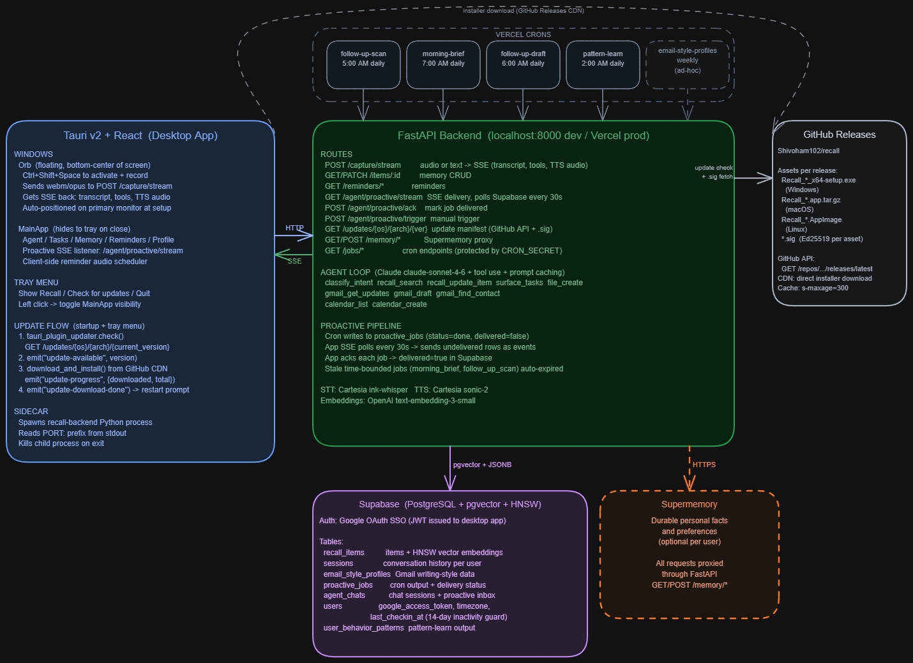

# Recall

Desktop voice agent for productivity. Hit a hotkey, speak a thought, and Recall transcribes, classifies, stores it, and responds by voice. Ask what's open, what you got done, or what needs follow-up. Draft emails, check your calendar, create files, all in context.

---

## What it does

- **Quick capture**: `Ctrl+Shift+Space`, one sentence, done in ~10 seconds
- **Agentic conversations**: multi-turn voice chat with real tool use (memory search, Gmail, Calendar, file creation)
- **RAG memory**: retrieves semantically similar items from history before every response
- **Reminders**: set due dates by voice; audio reminder delivered at the right time
- **Gmail + Calendar**: read inbox, draft emails in your writing style, create events
- **Personal memory**: optional Supermemory integration for durable facts and preferences

---

## Architecture



**Capture flow:** hold mic -> webm/opus recorded -> `POST /capture/stream` -> Cartesia STT -> RAG retrieves similar items -> Claude agentic loop with tools -> SSE yields transcript, tool steps, spoken text, and TTS audio -> item stored if actionable.

---

## Tech stack

| Layer | Technology |
|---|---|
| Desktop shell | Tauri v2 |
| Frontend | React 19 + TypeScript + Vite |
| Backend | FastAPI + Python 3.11+ |
| Auth | Supabase Auth (Google OAuth SSO) |
| STT / TTS | Cartesia `ink-whisper` / `sonic-2` |
| Agent | Claude `claude-sonnet-4-6` with prompt caching |
| Embeddings | OpenAI `text-embedding-3-small` |
| Database | Supabase (PostgreSQL + pgvector, HNSW index) |
| Personal memory | Supermemory (optional) |
| Google APIs | Gmail + Google Calendar (optional) |

---

## Project structure

```
recall/
├── db/schema.sql             <- run in Supabase SQL editor
├── backend/
│   ├── main.py               <- FastAPI app + route registration
│   ├── agent.py              <- Claude sessions, agentic loop, prompt caching
│   ├── rag.py                <- embed(), retrieve_similar(), store_item()
│   ├── stt.py / tts.py       <- Cartesia transcription + synthesis
│   ├── routes/               <- voice, agent_stream, items, reminders, memory, jobs
│   └── tools/                <- memory, google_services, filesystem tools
└── app/src/
    ├── components/
    │   ├── OrbWindow.tsx     <- hotkey-triggered floating capture
    │   ├── MainApp.tsx       <- tab router + reminder scheduler
    │   └── tabs/             <- Agent, Tasks, Memory, Reminders, Profile
    ├── hooks/                <- useRecorder, useAuth
    └── services/             <- api, supabase client, reminderScheduler
```

---

[SETUP.md](SETUP.md) covers prerequisites, environment config, database init, Google OAuth, and troubleshooting.
